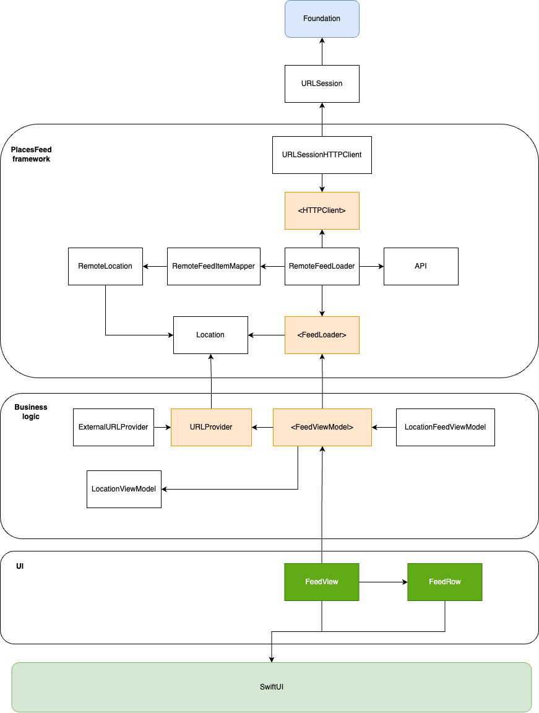

# Technical assignment - Wikipedia location service app

## Wikipedia app

In order to open the Wikipedia app using a deeplink, I need to:
- find out what is the existing way of handing deep/universal links
- adjust the logic in a way that is consistent with the existing codebase
- try reusing existing mechanism instead of adding my own solutions 

Diff with changes made can be found (here)[https://github.com/wikimedia/wikipedia-ios/compare/main...atmamont:wikipedia-ios-abn-amro-assignment:feature/places_deep_link]

In short, logic is:
- whenever we detect `Places` deep/universal link, we parse all query parameters trying to instantiate full location object (simple dictionary)
- on success, we pass this object via new `PlacesViewController` API call to `showPlace(_ place: Place)`
- on failure we proceed with the standard logic trying to open an article with a given URL

## Places app

### Comments

My goal for this app was not only to meet the criteria but most also learn something new.
We do not use much of SwiftUI in production yet so I decided this is the perfect opportunity to leverage new `Observability` framework. It removes some workarounds that were needed before to make abstractions over observable data types and it feel it's a breeze now! I truly enjoyed the speed and experience bulding this simple app. I was interested mostly in decoupling SwiftUI fully so it's imports do not pollute the rest of the codebase (at least no SwiftUI imports in view models so they can stay reusable).
Another goal was to write a couple of unit tests for views but unlike the UIKit, I didn't find quickly a way to simulate view loading (something similar to `sut.loadViewIfNeeded()` in `UIViewController`) that usually start the test sequence.
However, I learned how to write unit tests again `@Observable` and now have less white spots on the `SwiftUI` map.

### What to improve

1. I briefly researched ways to improve optionality when used as Binding and didn't find the nice way. Everything seemed to be a compromise so I just made view model parameters non-optional. However, in real project I would of course never use an empty string instead of optional.
2. Some code could be extracted more for reuse (like opening an external app using `UIApplication.shared.open`)
3. SwiftUI UI part is very basic as I decided that this is something I can spend a lot of time on without good returns considering my basic knowledge of SwiftUI. I prefered to invest my time in architecture and unit tests.
4. I wonder  
  
### Dependencies diagram 

