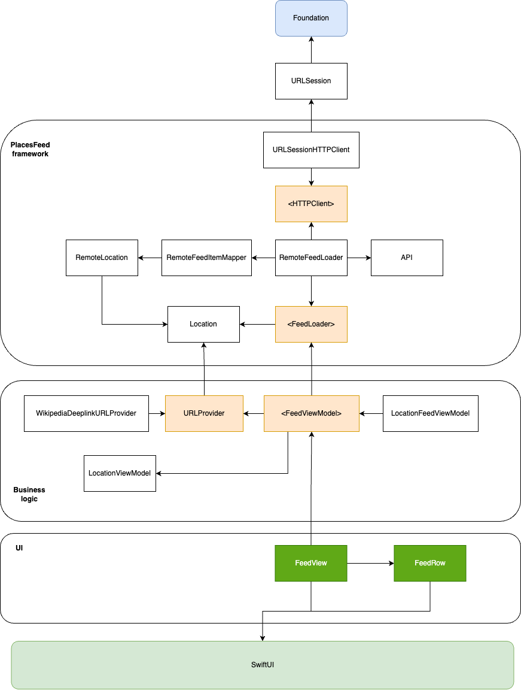

# Technical Assignment - Wikipedia Location Service App

## Wikipedia App

To open the Wikipedia app using a deep link, the following steps are required:

- Find out the existing way of handling deep/universal links.
- Adjust the logic to be consistent with the existing codebase.
- Attempt to reuse the existing mechanism instead of creating new solutions.

You can find the diff with changes made [here](https://github.com/wikimedia/wikipedia-ios/compare/main...atmamont:wikipedia-ios-abn-amro-assignment:feature/places_deep_link).

In short, the logic is as follows:

- Whenever a `Places` deep/universal link is detected, parse all query parameters to instantiate a full location object (a simple dictionary).
- On success, create a wrapper `Places` object and pass it via a new `PlacesViewController` API call to `showPlace(_ place: Place)`.
- On failure, proceed with the existing logic of trying to open an article with the given URL.

## Places App

### Comments

- My goal for this app was not only to meet the criteria but also to learn something new.  
- We don't use much SwiftUI in production yet, so I saw this as the perfect opportunity to leverage the new `Observability` framework and improve my understanding of SwiftUI data flow, which will be useful for integrating SwiftUI into larger UIKit projects. This approach eliminates the need for workarounds previously required to make abstractions over observable data types. Building UI with SwiftUI was a breeze, and I focused on properly decoupling SwiftUI from the business logic and other layers, including view models. It seemed to work well.  
- Another goal was to write a couple of unit tests for SwiftUI view-triggered behaviors. Unlike UIKit, I didn't find a quick way to simulate view loading (something similar to `sut.loadViewIfNeeded()` in `UIViewController`) to start the test sequence. I don't think it's difficult, but I ran out of time due to a packed week.
- However, I learned how to write unit tests with `@Observable`, and it looks nice right out of the box, without additional helpers and wrappers typically needed to make test code readable.

### What to Improve

- I briefly researched ways to improve optionality when used as `Binding` and didn't find a quick and nice solution. Everything seemed to be a compromise, so I made view model parameters non-optional. In a real project, I would never use an empty string instead of optional.
- More code could be extracted for reuse, such as opening an external app using `UIApplication.shared.open`.
- The UI part is quite basic because I decided that I could spend a lot of time on it without significant returns, given my basic knowledge of SwiftUI. I preferred to invest my time in the architecture and unit tests.
- The "Open custom location" screen is a trade-off. I wish I had more time to introduce a new caching layer (possibly using SwiftData) and add a custom user-provided location to the main dataset so it automatically appears on the main feed. For now, let's focus on meeting the requirements without adding the new location to the dataset. I would do the same in a real project meeting the deadline and improving in the following sprints assumints the metrics for this feature indicate that this is something really needed.
- Error handling is not present in the UI part. All errors are properly handled and passed from the feed loading layer but are ignored in the view model. If I had more time, I would propagate them to the view and present a simple alert.

### Dependencies Diagram

